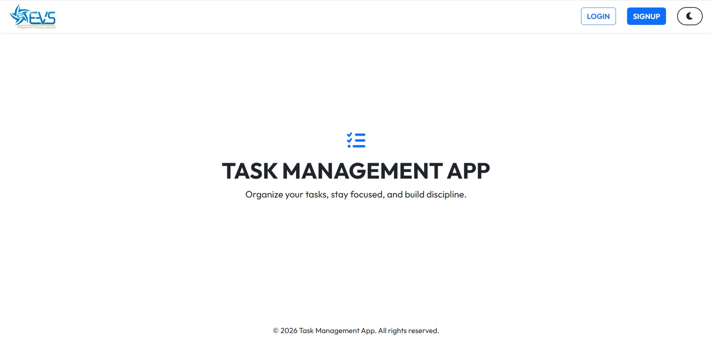
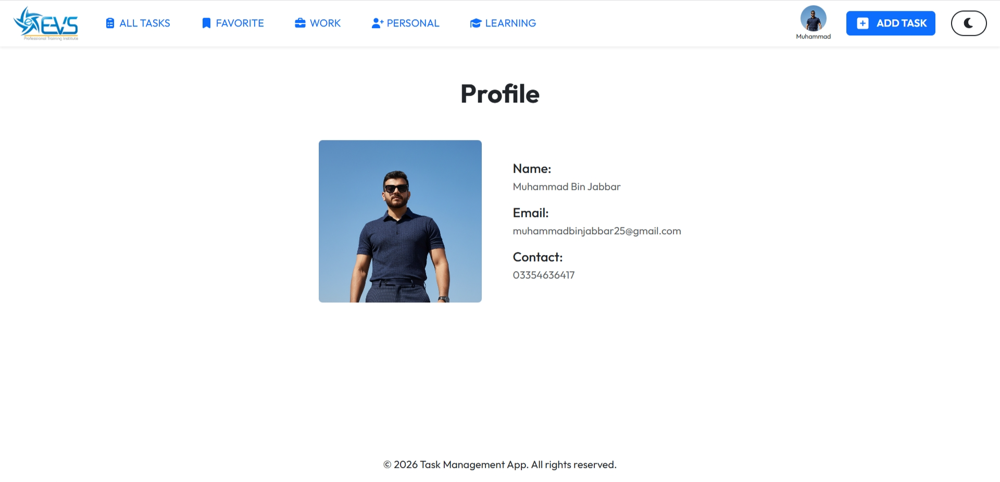
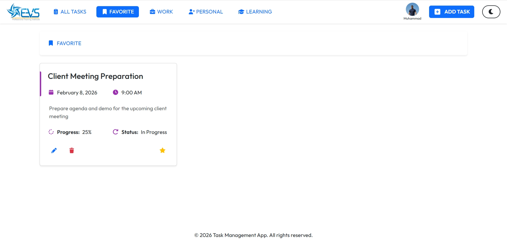
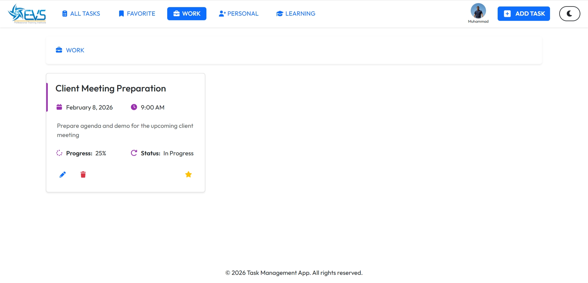
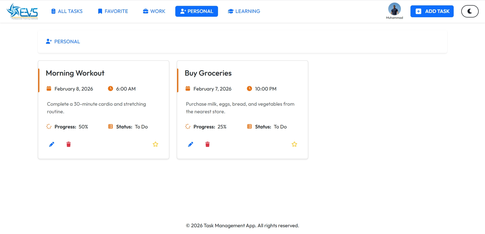
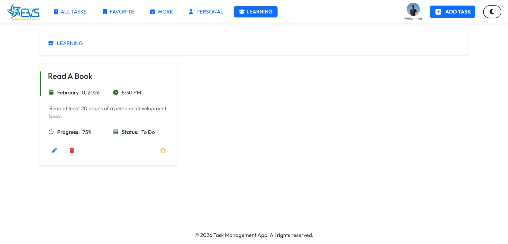

<h1 align="center">📑 Task Management App (MERN)</h1>
<p align="center">A full-stack task management web application built with the MERN stack</p>
<p align="center">


</p>

---
## 🚀 Features
- 🔐 **User Authentication** (JWT Login/Register)
- 📝 **Task Management** – Create, Edit, Delete
- ⭐ **Favorites** – Mark tasks as favorite
- 🗂️ **Categories** – Organize tasks
- 🖼️ **Profile Image Upload**
- ⚡ **Optimistic UI Updates**
- 📱 **Responsive Design**
- 🌙 **Dark Theme Mode**
---
## 🛠️ Tech Stack
| Frontend | Backend |
|----------|---------|
| React.js | Node.js |
| Redux Toolkit | Express.js |
| React Bootstrap | MongoDB |
| React Toastify | Mongoose |
| React Router DOM | JWT Authentication |
|  | Bcrypt (Hashing Password) |
|  | Multer (Image Upload) |

---
## 📂 Project Structure
Here’s an overview of the project’s folder organization:
```
task-management-app/

│
├── client/ # React frontend
│ ├── public/ # Static files like index.html, favicon
│ └── src/ # React source code (components, pages, styles, etc.)
│
├── server/ # Node/Express backend
│ ├── controllers/ # Request handlers
│ ├── models/ # Database schemas
│ ├── routes/ # API routes
│ └── app.js # Main server file
│
├── README.md # Project documentation
└── .gitignore # Files \& folders to ignore in Git
```
---
## ⚙️ Environment Variables

Create a `.env` file inside the **server** folder and add:

```
MONGO_URI=your_mongodb_connection_string
JWT_SECRET=your_secret_key
PORT=5000
```

---
## ▶️ Run Locally
### 1️⃣ Clone the repository
```
git clone https://github.com/mbinjabbar/task-management-app.git
```
### 2️⃣ Install dependencies
#### 📂 Server
```
cd server
npm install
```
#### 📂 Client
```
cd client
npm install
```
### 3️⃣ Start the app
#### 📂 Server
```
npm run dev
```
#### 📂 Client
```
npm run dev
```
---
## 📸 Screenshots
#### Home Page:
<p align="center">

</p>

#### Profile Page:
<p align="center">

</p>

#### Favorite Page:
<p align="center">

</p>

#### Work Page:
<p align="center">

</p>

#### Peronsal Page:
<p align="center">

</p>

#### Learning Page:
<p align="center">

</p>

---

## 🎯 Key Highlights
- Clean and modular architecture
- Reusable components
- RESTful API design
- Secure authentication system
- Real-world production structure

## 👨‍💻 Author
### Muhammad Bin Jabbar
GitHub: https://github.com/mbinjabbar

## ⭐ Support
If you like this project, don’t forget to give it a star ⭐ on GitHub!

